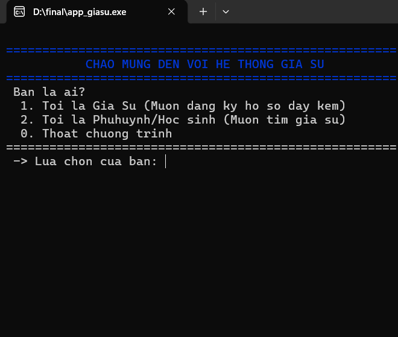
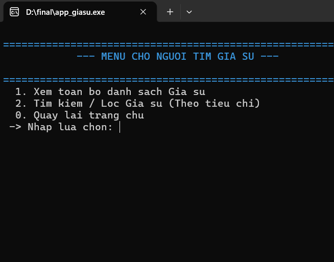
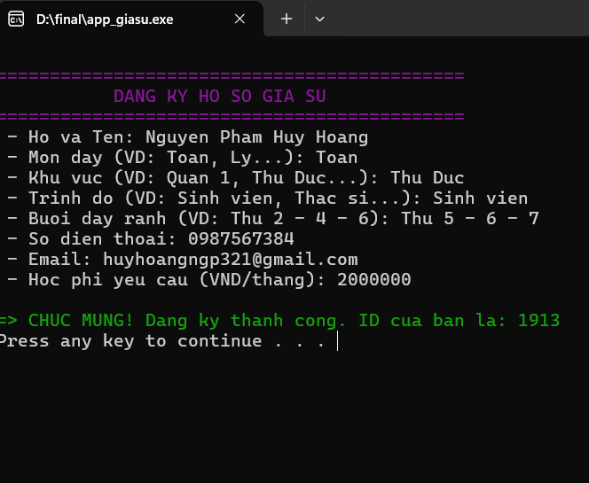

# 👨‍🏫 HỆ THỐNG TÌM KIẾM VÀ QUẢN LÝ GIA SƯ TẠI TP.HCM (C CONSOLE APPLICATION)


Dự án Bài tập lớn môn **Kỹ thuật lập trình** được thực hiện bởi sinh viên khóa K66 - Khoa Công nghệ thông tin, Trường Đại học Giao thông Vận tải Phân hiệu tại TP.Hồ Chí Minh (UTC2).

* **Giảng viên hướng dẫn:** ThS. Trần Thị Dung
* **Thành viên nhóm thực hiện:**
    1.  Ngô Thị Ngọc Ánh (MSSV: 6651071003)
    2.  Nguyễn Đức Đại Dương (MSSV: 6651071011)
    3.  Nguyễn Hoài Hận (MSSV: 6651071020)
    4.  Lê Thị Ngọc Tuyết (MSSV: 6651071091)

---

## 📑 Mục Lục
* [1. Tổng Quan Dự Án](#1-tổng-quan-dự-án)
* [2. Cấu Trúc Mã Nguồn](#2-cấu-trúc-mã-nguồn-repository-structure)
* [3. Yêu Cầu Môi Trường](#3-yêu-cầu-môi-trường-prerequisites)
* [4. Hướng Dẫn Biên Dịch Và Chạy Ứng Dụng](#4-hướng-dẫn-biên-dịch-và-chạy-ứng-dụng)
* [5. Kịch Bản Kiểm Thử Dành Cho Tester](#5-kịch-bản-kiểm-thử-dành-cho-tester)
* [6. Một Số Lưu Ý Quan Trọng Khi Chạy Thử](#6-một-số-lưu-ý-quan-trọng-khi-chạy-thử-troubleshooting)

---

## 1. Tổng Quan Dự Án
Ứng dụng được viết hoàn toàn bằng ngôn ngữ **C (tiêu chuẩn C99)** hoạt động trên giao diện dòng lệnh (Console). Hệ thống cung cấp giải pháp kết nối tối ưu giữa Gia sư (những người có nhu cầu giảng dạy) và Phụ huynh/Học sinh dựa trên bộ lọc đa tiêu chí, tự động hóa kịch bản hệ thống và tích hợp giao tiếp thế giới thực thông qua giao thức mạng.

### Các đặc điểm kỹ thuật nổi bật:
* **Kiến trúc vi mô (Micro-modules):** Chia tách toàn bộ logic nghiệp vụ ra 7 file riêng biệt theo nguyên lý *Single Responsibility*.
* **Quản lý bộ nhớ động:** Sử dụng cấu trúc danh sách liên kết đơn (`Singly Linked List`) để xử lý cơ sở dữ liệu trên RAM một cách vô hạn, tối ưu hóa vùng nhớ bằng cơ chế giải phóng bộ nhớ triệt để trước khi thoát.
* **Menu động thông minh (Dynamic Menu):** Hệ thống tự động quét tệp dữ liệu phẳng để thu thập các thuộc tính duy nhất của dữ liệu (Trình độ, Buổi dạy) nhằm tự sinh menu tương tác mà không cần cấu hình cứng (hard-code).
* **Tự động hóa kịch bản gửi Email:** Kết hợp lệnh hệ thống (`System Call`) để tạo và thực thi ngầm script Windows PowerShell, thực hiện truyền tải dữ liệu đặt lịch qua máy chủ SMTP Gmail bằng cổng mã hóa SSL/TLS.
* **Giao diện phân tầng ANSI:** Sử dụng hệ màu sắc ANSI escape code phong phú giúp phân tầng thông tin trực quan hóa bảng biểu Console 119 ký tự chuẩn mực.

### 📸 Giao diện thực tế của ứng dụng:
Menu 1: Phân quyền người dùng

Menu 2: Danh cho gia sư

Menu 3: Dành cho phụ huynh / học sinh người cần tìm gia sư


---

## 2. Cấu Trúc Mã Nguồn (Repository Structure)

Dự án được tổ chức chặt chẽ thành các mô-đun chức năng sau:

```text
📦 DU_AN_GIA_SU
├── 📜 main.c           # Điểm khởi chạy, điều phối Menu chính
├── 📜 giasu.h          # Cấu trúc dữ liệu, biến toàn cục, màu ANSI
├── 📜 danhsach.c       # Quản lý danh sách liên kết, thao tác File
├── 📜 xuly.c           # Thuật toán tìm kiếm, chuẩn hóa chuỗi
├── 📜 giaodien.c       # In bảng giao diện Console, Menu động
├── 📜 dangkygiasu.c    # Nhập hồ sơ, tự động cấp mã ID mới
├── 📜 datlich.c        # Đặt lịch học, tự động bắn Email SMTP
├── 📄 giasu.txt        # Cơ sở dữ liệu (Database)
└── 📄 datlich.txt      # Lịch sử lưu vết giao dịch (Log)
```

---

## 3. Yêu Cầu Môi Trường (Prerequisites)

Để hệ thống biên dịch và vận hành chính xác tất cả các chức năng nâng cao, môi trường chạy thử của **Tester** cần đảm bảo:
1.  **Hệ điều hành:** Microsoft Windows 10 hoặc Windows 11 (Bắt buộc để hỗ trợ công cụ `PowerShell` gửi Mail và cơ chế dọn màn hình hệ thống `system("cls")`).
2.  **Trình biên dịch:** `GCC (GNU Compiler Collection)` phiên bản hỗ trợ C99 (Tích hợp sẵn trong Dev-C++ 5.11, MinGW hoặc cài kèm qua MSYS2 trên VS Code).
3.  **Kết nối mạng:** Cần có kết nối Internet hoạt động để kiểm thử chức năng gửi Email về tổng đài.

---

## 4. Hướng Dẫn Biên Dịch Và Chạy Ứng Dụng

Để tiến hành kiểm thử (Test) ứng dụng, bạn vui lòng thực hiện theo đúng 3 bước sau:

**Bước 1: Mở Terminal tại thư mục dự án**
Bật công cụ `PowerShell` hoặc `Command Prompt` (CMD) trên máy tính và di chuyển đường dẫn (`cd`) vào đúng thư mục đang chứa mã nguồn. 
*(Lưu ý: Phải đảm bảo file `giasu.txt` nằm chung thư mục với các file code `.c`).*

**Bước 2: Biên dịch hệ thống (Build)**
Copy và dán dòng lệnh sau vào Terminal để gộp 6 file mã nguồn lại thành 1 file thực thi. Bấm Enter:
`gcc main.c xuly.c danhsach.c giaodien.c dangkygiasu.c datlich.c -o app_giasu.exe`
*(Note cho Tester: Nếu Terminal hiện ra một vài dòng chữ vàng "warning: Using gets() is always unsafe", hãy cứ bỏ qua vì đây chỉ là cảnh báo của trình biên dịch, file .exe vẫn được tạo ra thành công).*

**Bước 3: Khởi chạy ứng dụng (Run)**
Sau khi biên dịch xong, gõ lệnh sau để mở App và bắt đầu quá trình Test:
`.\app_giasu.exe`

---

## 5. Kịch Bản Kiểm Thử Dành Cho Tester

Để hỗ trợ nghiệm thu sản phẩm một cách nhanh chóng và bao phủ toàn diện tính năng, Tester hãy thực hiện theo chuỗi kịch bản dưới đây:

### Test Case 1: Khởi tạo hệ thống & Nạp dữ liệu thành công
* **Thao tác thực hiện:** Khởi chạy file `app_giasu.exe`. Tại giao diện chính, chọn vai trò `Phụ huynh/Học sinh (Nhập số 2)` -> Chọn tiếp `Xem toàn bộ danh sách Gia sư (Nhập số 1)`.
* **Kết quả kỳ vọng:** Chương trình nạp file thành công. Bảng Console hiển thị danh sách các gia sư đầy đủ thông tin, căn lề thẳng hàng, các trường học phí và đánh giá được tô màu sắc rõ ràng theo dữ liệu gốc từ file `giasu.txt`.

### Test Case 2: Đăng ký Gia sư mới & Đồng bộ thời gian thực
* **Thao tác thực hiện:** Tại Menu chính, chọn vai trò `Gia sư (Nhập số 1)`. Tiến hành điền đầy đủ các thông tin cá nhân theo yêu cầu từng dòng. Thử nhập mức Học phí yêu cầu là `200000`.
* **Kết quả kỳ vọng:**
    * Hệ thống phải tự động tính toán cấp mã ID mới bằng công thức: $ID_{mới} = ID_{max\_hiện\_tại} + 1$ (ID tối thiểu bắt đầu từ mốc 1000).
    * Điểm đánh giá (Rating) mặc định hiển thị trong hồ sơ phải bằng `5.0`.
    * Sau khi nhấn thông báo thành công, mở file `giasu.txt` lên kiểm tra, dòng cuối cùng phải xuất hiện bản ghi vừa nhập. Khi quay lại Menu người tìm kiếm xem danh sách, bản ghi mới phải lập tức xuất hiện trên RAM mà không cần tắt ứng dụng đi bật lại.

### Test Case 3: Bắt lỗi nhập liệu dữ liệu sai định dạng (Input Validation)
* **Thao tác thực hiện:**
    * Tại các Menu lựa chọn số: Cố tình nhập chuỗi chữ cái (Ví dụ: `abc`, `xyz`).
    * Tại màn hình nhập Học phí yêu cầu của gia sư: Cố tình nhập ký tự chữ cái thay vì số nguyên.
* **Kết quả kỳ vọng:** Ứng dụng không bị đóng băng, không rơi vào vòng lặp vô tận (Infinite loop) hoặc sập tiến trình (`crash`). Hệ thống phải ép giá trị nhập sai về định dạng an toàn (bằng 0) hoặc thông báo lỗi và yêu cầu nhập lại, bảo vệ bộ nhớ RAM không bị tràn dữ liệu.

###  Test Case 4: Thuật toán so khớp chuỗi chuẩn xác (Anti-Overlap Substring Match)
* **Thao tác thực hiện:** Vào menu tìm kiếm gia sư, tại mục nhập `Khu vực`, thử gõ từ khóa `Quận 1`.
* **Kết quả kỳ vọng:** Hàm thuật toán đặc biệt `timKhuVucChuan()` phải kích hoạt cơ chế chặn ký tự số ở đuôi chuỗi khớp con. Bảng kết quả trả về **CHỈ** được phép xuất hiện những gia sư thuộc địa bàn `Quận 1`. Hệ thống tuyệt đối không được hiển thị nhầm các gia sư thuộc `Quận 10`, `Quận 11` hay `Quận 12`.

###  Test Case 5: Bộ lọc phối hợp đa tiêu chí & Sắp xếp giảm dần
* **Thao tác thực hiện:** Chọn tính năng `Tìm kiếm / Lọc Gia sư (Nhập số 2)`. Tiến hành gõ môn học `Toan`, Khu vực `Quan 1`, chọn một trình độ từ menu động và nhập mức Học phí tối đa là `180000`.
* **Kết quả kỳ vọng:**
    * Hệ thống phải lọc đồng thời tất cả các điều kiện dựa trên cơ chế cờ hiệu liên hoàn. Tổng số gia sư tìm được phải in rõ ở dòng tiêu đề bảng màu đỏ chói.
    * Toàn bộ danh sách gia sư lọc ra bắt buộc phải được sắp xếp theo thứ tự **Rating (Điểm đánh giá) giảm dần từ cao xuống thấp** nhờ thuật toán `qsort` thư viện chuẩn C.

###  Test Case 6: Trigger kịch bản tự động hóa gửi Email SMTP
* **Thao tác thực hiện:** Sau khi màn hình hiển thị danh sách gia sư thỏa điều kiện, nhập một ID gia sư bất kỳ đang có trong bảng để vào màn hình Hồ sơ chi tiết. Nhập phím `1` để chọn Đặt lịch học. Điền Tên phụ huynh, SĐT và lời nhắn, bấm Enter.
* **Kết quả kỳ vọng:**
    * Hệ thống sinh nhanh file script tạm thời `sendmail.ps1` trong thư mục.
    * PowerShell Windows chạy ngầm trong khoảng 2-4 giây để kết nối cổng mạng SSL/TLS của Google.
    * Sau khi màn hình in dòng chữ màu xanh lá `"GUI TONG DAI THANH CONG!"`, file kịch bản tạm thời `sendmail.ps1` phải tự động biến mất hoàn toàn khỏi ổ cứng (tự hủy để bảo mật thông tin).
    * Hộp thư email ban quản lý nhận được thông báo chi tiết chứa đầy đủ text nhập từ phụ huynh và hồ sơ gia sư bị đặt lịch.

---

## 6. Một Số Lưu Ý Quan Trọng Khi Chạy Thử (Troubleshooting)

> **1. Lỗi không mở được file dữ liệu:** Nếu app báo lỗi thiếu tệp `giasu.txt` ngay khi vừa chạy, hãy kiểm tra chắc chắn rằng tệp text dữ liệu đang nằm cùng một folder chứa file thực thi `.exe` chứ không bị để lạc ra ngoài.
>
> **2. Lỗi phân quyền PowerShell (Execution Policy):** Một số máy trạm cài đặt bảo mật Windows quá cao có thể chặn script. Tuy nhiên, mã nguồn của nhóm đã chủ động truyền tham số `-ExecutionPolicy Bypass` để mượn đường hệ điều hành một cách hợp pháp, giúp bỏ qua bước xác thực quyền cấu hình cục bộ của Windows.
>
> **3. Warning bảo mật:** Module Email hoạt động theo cơ chế đồng bộ (Synchronous) nên app sẽ khựng nhẹ khoảng 2-3 giây khi kết nối mạng gửi dữ liệu đi, đây là đặc tính kiến trúc xử lý tuần tự của ngôn ngữ C thuần trên console.
